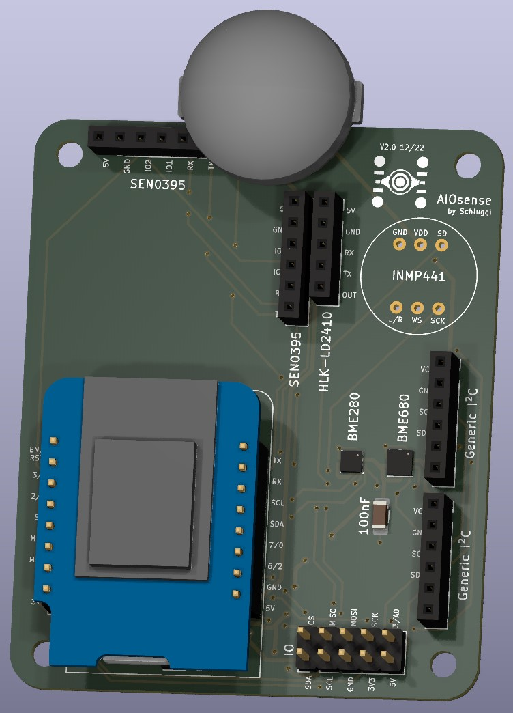
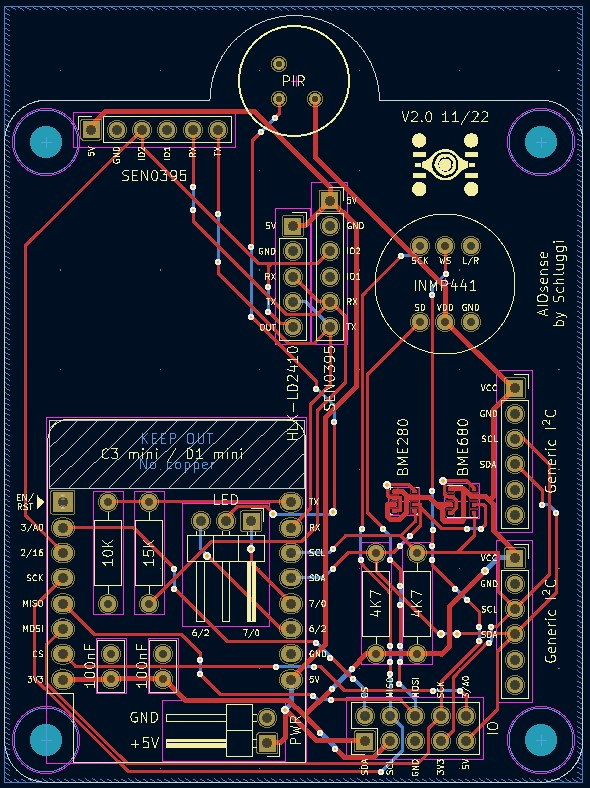
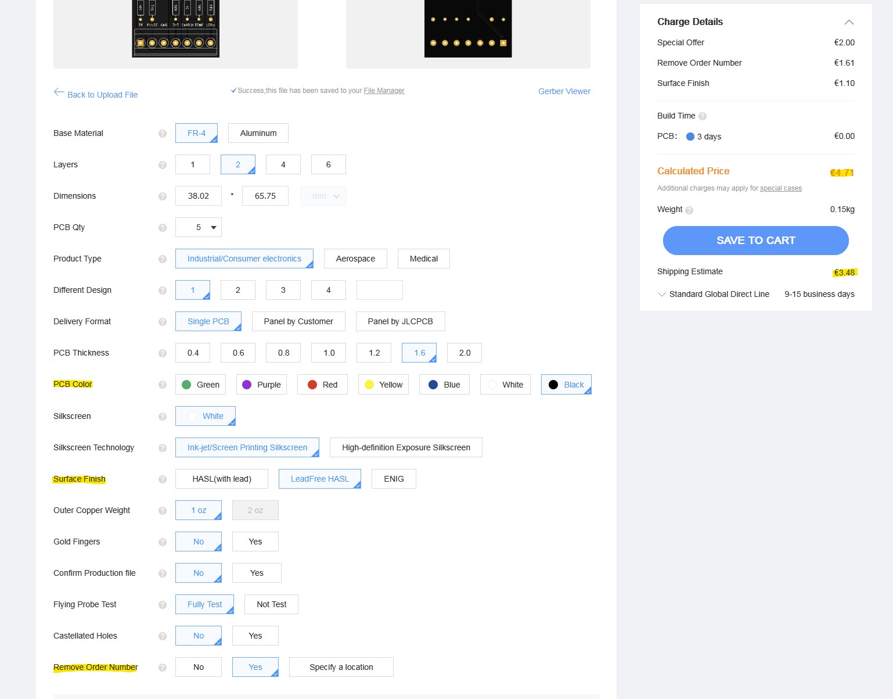

# AIOsense

## What is this?
This project is based on the idea of the [Presence One](https://shop.everythingsmart.io/en-de/products/everything-presence-one-kit?variant=41708846022853). I made my own,
less expensive open-source version of it.

This all-in-one-sensor covers all the features of the original, plus these extras:
- swappable microcontroller
- open-source
- additional sensors
  - air pressure
  - air quality
- modular
- less expensive

Supported sensors (all sensors are optional):
- motion sensor (EKMC1603111)
- mmWave sensor ([SEN0395](https://wiki.dfrobot.com/mmWave_Radar_Human_Presence_Detection_SKU_SEN0395))
- light sensor (BH1750)
- temperature, humidity and pressure sensor (BME280¹)
- temperature, humidity, pressure and air quality sensor (BME680¹)

> ¹ You have to choose between the BME280 or the BME680 or neither. It's not possible to use both sensors.

## What does it look like?
| 3D | 2D |
| --- | --- |
|||

## Components & Prices
| Name             | Description                                          | Price per unit | Links                                                                                                                                                                                                                                                                                                                                                          |
|------------------|------------------------------------------------------|----------------|----------------------------------------------------------------------------------------------------------------------------------------------------------------------------------------------------------------------------------------------------------------------------------------------------------------------------------------------------------------|
| EKMC1603111      | PIR Motion Sensor                                    | 13 €           | [Mouser](https://www.mouser.de/ProductDetail/Panasonic-Industrial-Devices/EKMC1603111?qs=7jYh1P364wm%252bee2n5xwlWg%3D%3D), [Farnell](https://de.farnell.com/en-DE/panasonic-electric-works/ekmc1603111/sensor-motion-12m-white/dp/2095731?st=ekmc1603111), [Digi-Key](https://www.digikey.de/de/products/detail/panasonic-electric-works/EKMC1603111/2601880) |
| SEN0395          | mmWave sensor                                        | 29 €           | [Mouser](https://www.mouser.de/ProductDetail/DFRobot/SEN0395?qs=ljCeji4nMDmvEgq75EdCVA%3D%3D), [Farnell](https://de.farnell.com/en-DE/dfrobot/sen0395/mmwave-radar-board-arduino-board/dp/3879712), [Digi-Key](https://www.digikey.de/de/products/detail/dfrobot/SEN0395/14322660?s=N4IgTCBcDaIMoFEByAGAzATgKwgLoF8g)                                          |
| BH1750           | light/illuminance sensor                             | 2.50 €         | [Amazon DE³](https://amzn.to/3FVbLmP)                                                                                                                                                                                                                                                                                                                          |
| BME280¹          | temperature, humidity and air pressure sensor        | 8 €            | [Mouser](https://www.mouser.de/ProductDetail/Bosch-Sensortec/BME280?qs=2OnyuXx6vpj2fK9HX7qb3g%3D%3D), [Digi-Key](https://www.digikey.de/de/products/detail/bosch-sensortec/BME280/6136306)   	                                                                                                                                                                 |
| BME680¹          | temperature, humidity, air pressure & quality sensor | 14 €           | [Mouser](https://www.mouser.de/ProductDetail/Bosch-Sensortec/BME680?qs=v271MhAjFHjo0yA%2FC4OnDQ%3D%3D), [Digi-Key](https://www.digikey.de/de/products/detail/bosch-sensortec/BME680/7401317)                                                                                                                                                                   |
| PCB              | the main PCB to mount all other components           | 3 €            | [JLCPCB](https://jlcpcb.com/), [PCBWay](https://www.pcbway.com/)                                                                                                                                                                                                                                                                                               |
| ESP8266 D1 mini² | mini ESP8266 based NodeMCU (without bluetooth)       | 4 €            | [Amazon DE³](https://amzn.to/3FWUFoO)                                                                                                                                                                                                                                                                                                                          |
| ESP32 D1 mini²   | mini ESP32 based NodeMCU (with bluetooth)	           | 8 €            | [Amazon DE³](https://amzn.to/3UfjWid)                                                                                                                                                                                                                                                                                                                          |

So it's possible to get a basic sensor for about 60€ (ESP8266 & BME280). If you can get the functionality (+ air pressure) as the [Everything Presence One](https://shop.everythingsmart.io/en-de/collections/everything-presence-one)
for about 64€ (ESP32 & BME280). And the full package (ESP32 & BME680) with an additional air quality sensor for about 70€.

Furthermore, you will need these components:
- [Resistors (Amazon DE³)](https://amzn.to/3FVrl1N)
  - 2x 4.7k
  - 1x 10k
  - 1x 15k
- [Capacitors (Amazon DE³)](https://amzn.to/3UA3glj)
  - 2x 100nF
- [Female Headers (Amazon DE³)](https://amzn.to/3FVUObX)
  - 2x 6pin
  - 2x 8pin
  - 1x 5pin
- 3pin TO-5 Socket (optional, if you want to make the motion sensor replaceable)

> ¹ You have to choose between the BME280 or the BME680 or neither. It's not possible to use both sensors.
>
> ² You have to choose between the ESP8266 or the ESP32. There is no need for the ESP32, but bluetooth.
>
> ³ Affiliate link

## How to order?
Ready? Let's go. I always order my PCBs via [JLCPCB](https://jlcpcb.com), a chinese PCB manufacturer.
1. Create an account
2. Click "Order now"
3. Upload the zip file located inside the [manufactoring](manufactoring) directory
4. Optional: Choose a different color, an ECO-friendly lead-free surface finish and check that no order number is
   printed on the PCB (for aesthetic reasons).

After all that, you got 5 PCBs for less than 10€.

## Questions?
Just open an issue :)

## Credits & Special thanks
Created and maintained by Lukas Schulte-Tickmann / Schluggi.

Special thanks:
- My dad for some electrical engineering advice
- [MeisterGig](https://github.com/MeisterGig) for some general discussions about the board
- [jankae](https://github.com/jankae) for PCB reviewing

Inspired by [EverythingSmartHome](https://everythingsmarthome.co.uk/). 