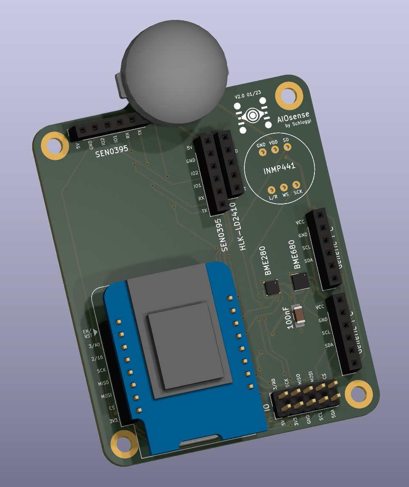

# AIOsense (All-In-One Sensor)

## Description

This project is based on the idea of
the [Presence One](https://shop.everythingsmart.io/en-de/products/everything-presence-one-kit).
I made my own, less expensive, modular & open-source version of it.

This board covers all the features of the original, plus these extras:

- swappable modules
- open-source
- additional sensors
    - air pressure
    - air quality (IAQ)
    - CO² equivalent
    - breath VOC equivalent

- modular
- less expensive
- customizable

Supported sensors are listed in the documentation:
[Sensor Modules](https://aiosense.readthedocs.io/en/latest/sensors/)

## What does it look like? 👀

| Without lid                        | With lid                             |
|------------------------------------|--------------------------------------|
|  |  |

> **Note:** The PCB in this image is not fully equipped either is this the final case
> design ([issue](https://github.com/Schluggi/AIOsense/issues/9)).

### Rendered images

| 3D                          | 2D                       |
|-----------------------------|--------------------------|
|  |  |

### Schematic

You can find the schematic [here](schematic/AIOsense.pdf).

## Power consumption

The power consumption depends on your configuration. On a fully equipped Board (ESP32-C3 + mmWave + PIR + BME280 +
LightSensor) we measured an idle power consumption of **0.45W / 0.09A** some peaks around **0.78W / 0.15A**.

Without a mmWave sensor the idle power consumption is around **0.11W / 0.02A** and peak near **0.45W / 0.09A**.

## How to start

You want to make your own AIOsense? 
Let's jump right into the [documentation](https://aiosense.readthedocs.io/en/latest/quickstart/).

## Questions?

Just open an [issue](https://github.com/Schluggi/AIOsense/issues/new) :)

## Credits & Special thanks

Created and maintained by Lukas Schulte-Tickmann / [Schluggi](https://github.com/Schluggi).

### Special thanks
- My dad for some electrical engineering advice and PCB reviewing
- [MeisterGig](https://github.com/MeisterGig) for the case design and some general discussions about the board
- [jankae](https://github.com/jankae) for PCB reviewing
- [reschandreas](https://github.com/reschandreas) for general repo work
- [PCBWay³](https://pcbway.com/g/DFb536) for sponsoring the PCB prototypes

### Contributors

 

Inspired by [EverythingSmartHome](https://everythingsmarthome.co.uk/).

³ Affiliate link