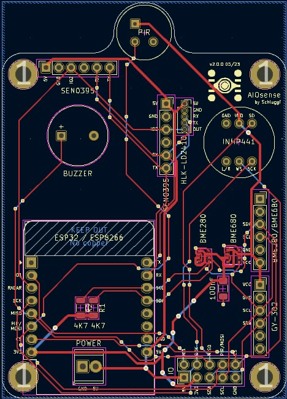

# AIOsense (All-In-One Sensor)

## Description
This project is based on the idea of the [Presence One](https://shop.everythingsmart.io/en-de/products/everything-presence-one-kit). 
I made my own, less expensive, modular & open-source version of it.

This board covers all the features of the original, plus these extras:
- swappable modules
- open-source
- additional sensors
  - air pressure
  - air quality
- modular
- less expensive
- customizable

Supported sensors are listed in the documentation: [Sensor Modules](https://github.com/Schluggi/AIOsense/wiki/How-to-start%3F#3-sensor-modules)

## What does it look like? 👀
| Without lid                        | With lid                             |
|------------------------------------|--------------------------------------|
|  |  |
> **Note:** The PCB in this image is not fully equipped either is this the final case design ([issue](https://github.com/Schluggi/AIOsense/issues/9)).

### Rendered images
| 3D                          | 2D                       |
|-----------------------------|--------------------------|
|  |  |

You can find the schematic [here](schematic/AIOsense.pdf).

## Interested?
You want to make your own AIOsense?

Let's jump right into the documentation: [How to start?](https://github.com/Schluggi/AIOsense/wiki/How-to-start-%3F)

## Questions?
Just open an [issue](https://github.com/Schluggi/AIOsense/issues/new) :)

## Credits & Special thanks
Created and maintained by Lukas Schulte-Tickmann / Schluggi.

Special thanks:
- My dad for some electrical engineering advice and PCB reviewing
- [MeisterGig](https://github.com/MeisterGig) for some general discussions about the board and the case design
- [jankae](https://github.com/jankae) for PCB reviewing
- [reschandreas](https://github.com/reschandreas) for spelling checks

Inspired by [EverythingSmartHome](https://everythingsmarthome.co.uk/).
