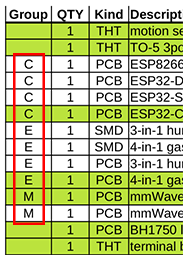

# BOM (Bill Of Materials)

You can find the BOM [here](https://github.com/Schluggi/AIOsense/bom).

You can get most parts from sellers
like [Mouser](https://www2.mouser.com/), [Farnell](https://www.farnell.com/)
or [Digi-Key](https://www.digikey.com/). Direct links to the sensors can be
found [here](sensors.md).

## Quickstart recommendation

Some lines in the BOM are marked green. This is our quickstart recommendation.
So if you don't know what do you really need and what is optional, just buy all
parts that are marked green, and you will end with an uncompromising AIOsense.

## Groups

Some parts in the BOM have a group letter. These are alternative options. So
please choice only one part within one group. For example both mmWave sensors
are in group `M`. So you have to pick one of them and can't use both at the same
time.

