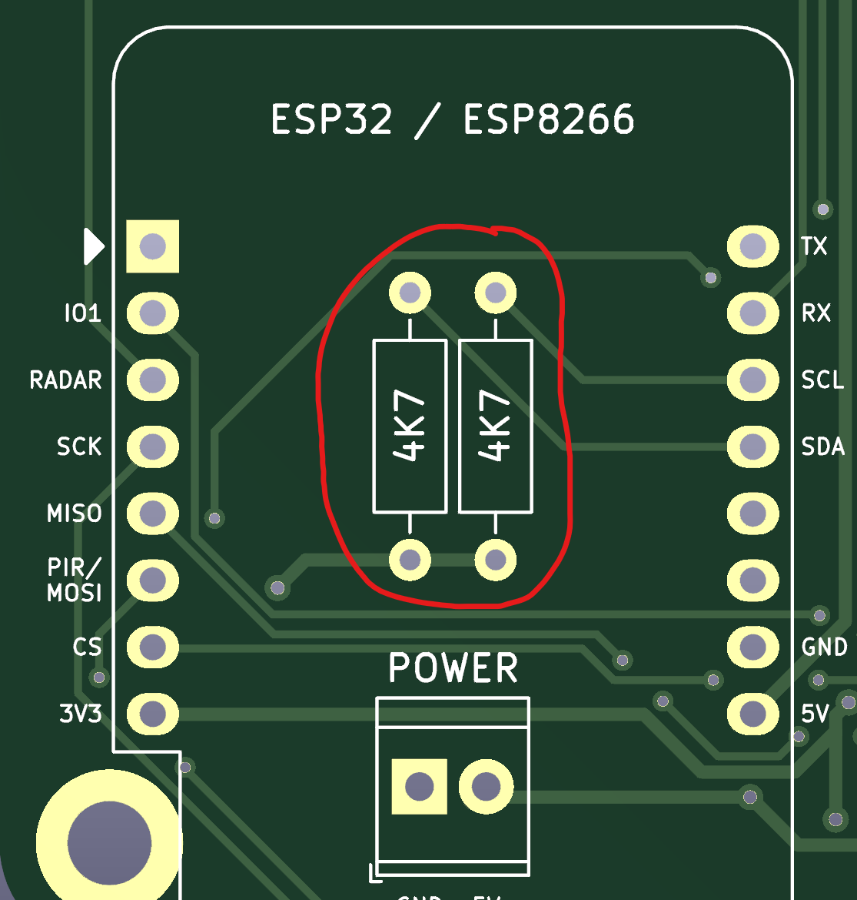

# 🐞 Debugging

## Inconsistent I²C readings

### I²C frequency

A first quick fix could be to choose a lower I²C frequency. In some cases this can already help to improve consistently
readings. You can do this by tweaking your yaml file and add a `frequency`.

```yaml
i2c:
  sda: 21
  scl: 22
  frequency: 10kHz  # (defaults to 50kHz)
```

### Too many pull-up resistors ([#44](https://github.com/Schluggi/AIOsense/issues/44))

We need I²C pull-up resistors to make I²C to work. But since every module has their own pull-ups, we're ending up with
too many pull-ups which can resolve in bad readings. This normally only happens if you had soldered the two 4K7 Ohm 
resistors and using the BME-Module (not the SMD version) as well as the Light-Module.  

The fix is easy: Remove both 4K7 Ohm resistors from the PCB.

