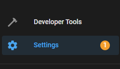
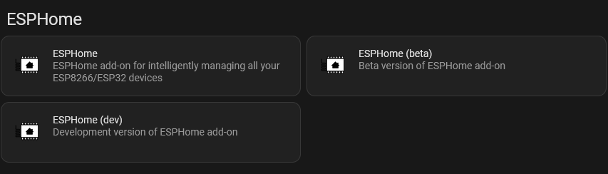
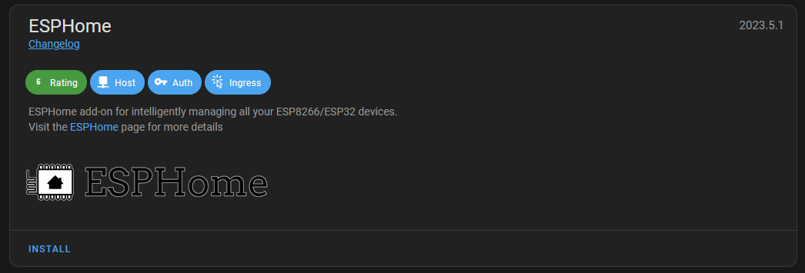
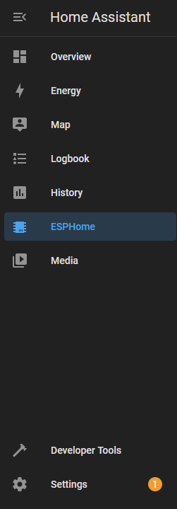
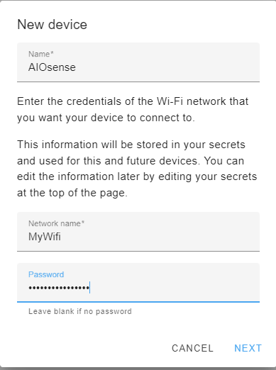
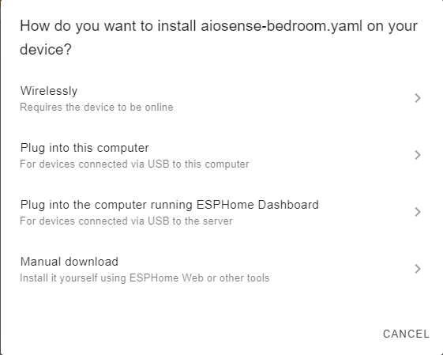
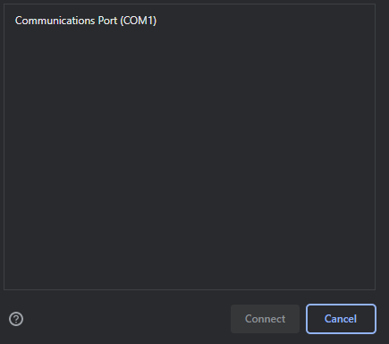
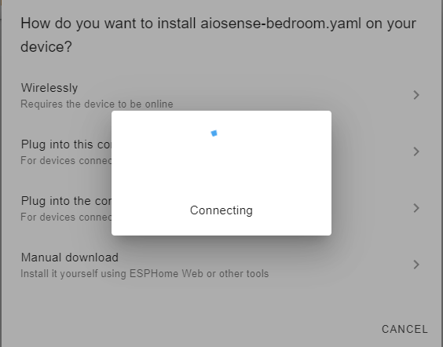

# Quickstart

{: style="height:80%;width:80%"}

> **Note:** You can also buy AIOsense as a kit
> on [tindie](https://www.tindie.com/products/gadgetgarage/aiosense/).

## Order PCB

First of all you need the PCB. We recommend PCBWay because it's the most
straight forward experience and the quality is excellent. Just click on the link
and take your order (you can also use [this link³](https://pcbway.com/g/DFb536)
for register to get 5$ off on your first order). But you can actually choose any
PCB manufacturer. Please notice that not all of them have the same capabilities.
We tried to make our PCB as generic as possible, it should work for most of them
but try this at your own risk.

- [PCBWay³](https://www.pcbway.com/project/shareproject/AIOsense_All_In_One_Sensor_132c1507.html)
- [Aisler](https://aisler.net/p/TWDRHBSM)

For all other manufacturer (like [JLCPCB](https://jlcpcb.com/)) please upload
the zip file which you can find at
the [release](https://github.com/Schluggi/AIOsense/releases/latest) page.

## Order parts

Now that you have the PCB, we still need the remaining parts. There is a
separate [BOM (Bill Of Materials)](https://github.com/Schluggi/AIOsense/tree/main/bom)
for
each AIOsense version. Open the pdf file and order all green marked lines.

You can get most parts from sellers
like [Mouser](https://www2.mouser.com/), [Farnell](https://www.farnell.com/)
or [Digi-Key](https://www.digikey.com/). Direct links to the sensors can be
found [here](sensors.md).

Please make sure you pick the right BME680 module. It should look like
this: {: style="height:50%;width:
50%"}

More info about the BOM and what the groups are all about can be
found [here](bom.md).

## Assembly (wip)

Should be easy and self explainable.

## Flashing Firmware

Now you have a fully assembled AIOsense but how can you integrate this in
Home Assistant?

### Installing the ESPHome dashboard

> This will only work for _Home Assistant OS_ and _Supervised_. For all other
> versions please use the
> [docker image](https://esphome.io/guides/getting_started_command_line.html#)
> or install it [manually](https://esphome.io/guides/installing_esphome.html).

First we need an ESPHome Dashboard. The best way to get one is by using the
official Home Assistant add-on.

Therefore, we go to our Home Assistant instance and click
on `Settings -> Add-ons`:

We can find the `ADD-ON STORE` in the bottom right corner:

We are looking for the ESPHome add-on (without beta and dev) and install it.

The installation can take several minutes, so please be patient. Afterward we
enable `Start on boot`, `Auto update` and `Show in sidebar`.

We can now open our dashboard by clicking on it at the sidebar:

### Flashing

With an open dashboard we can now flash our device, but first we need some
configuration.

Click `New Device` and fill out the form:

Skip the installation on the second screen and choose the ESP32-C3.

We don't need the encryption key yet. Skip it.

Our device is now displayed on the dashboard. You need to change the
configuration. Click `EDIT`.

This is the configuration that will be flashed onto your device. We need nothing of
this but the api encryption key and the ota password so copy/save these values
for later.

Replace the hole file with the content of
[this](https://github.com/Schluggi/AIOsense/blob/main/esphome/esphome.yaml)
file and replace both `<secret>` values with your saved ones and change lines
2-4 to the name you pick earlier.

Everything changed? Great! If not already done, connect the board via USB to
your PC, click `INSTALL` in the top right corner and
select `Plug into this computer` as flashing method.

> This will only work on a Chromium based browser. For all other browser please
> take a look how to flash manually

A popup will ask for the COM port. Select the port of the board and click
`Connect`.

Your browser will now connect to your board and flash it. This can take several
minutes. The blue circle will spin without any additional feedback. Be patient.

Your AIOsense is now ready to use

## Home Assistant Integration (wip)

...

## Further steps (optional)

- [Print a case](case.md)

³ Affiliate link

My PCB prototypes are sponsored by PCBWay.